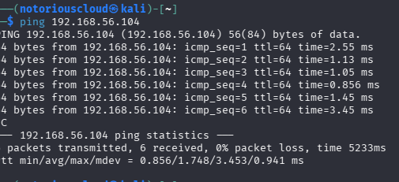
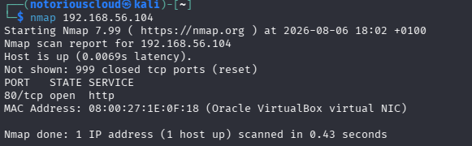
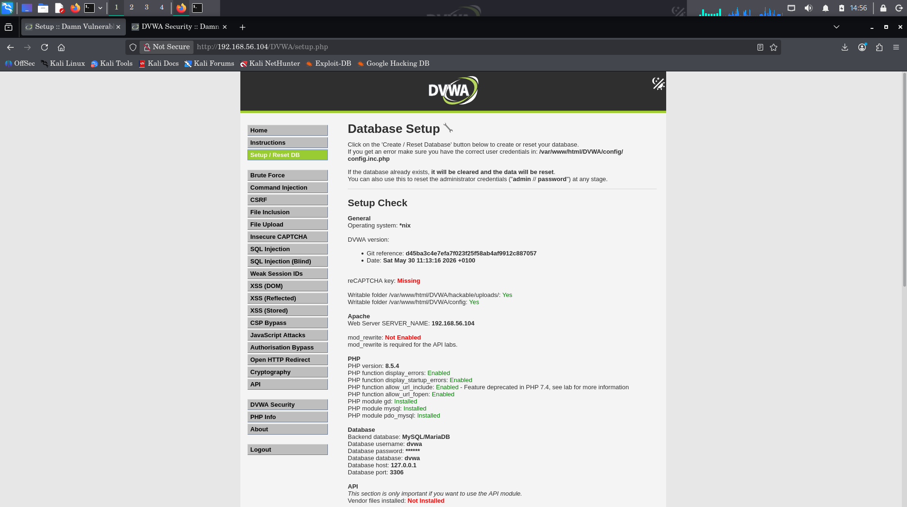
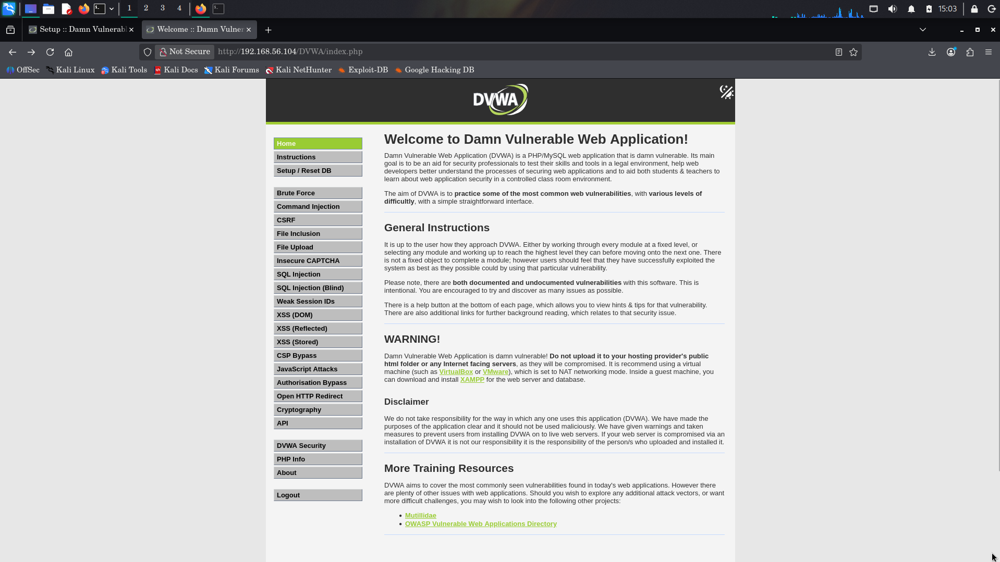
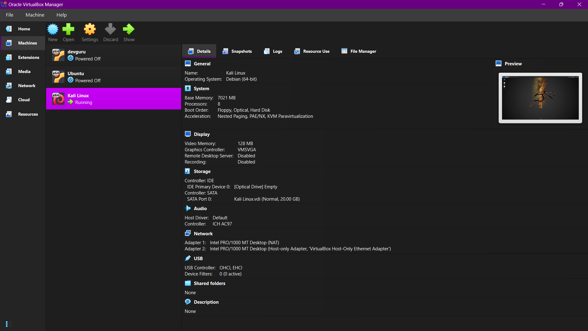
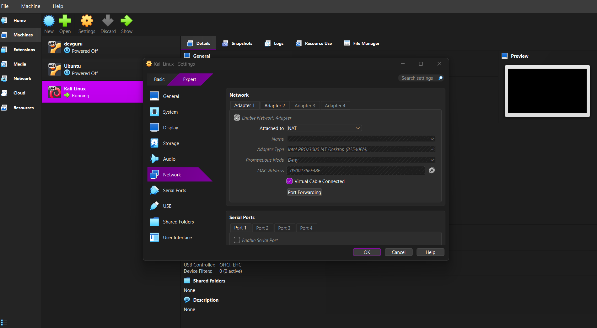

# 🛡️ Project 001 — Building a DVWA Penetration Testing Lab


## 📌 Project Overview

This project involved building a controlled penetration testing laboratory using Oracle VirtualBox, Kali Linux, Ubuntu, Apache, MariaDB, and Damn Vulnerable Web Application (DVWA).

The goal was to create an isolated environment where penetration testing and web application security concepts could be safely practiced.

The project covered:

- Virtual machine configuration
- Network configuration
- Linux administration
- Network connectivity testing
- Web server deployment
- DVWA installation and configuration
- Network reconnaissance
- Service enumeration
- Technical documentation

---

## 🎯 Objectives

The objectives of this project were to:

1. Build a controlled cybersecurity laboratory.
2. Configure Kali Linux as the attacker machine.
3. Configure Ubuntu as the target machine.
4. Establish communication between Kali and Ubuntu.
5. Deploy Apache and DVWA on Ubuntu.
6. Verify that DVWA was accessible from Kali.
7. Perform basic reconnaissance using Nmap.
8. Document the setup, troubleshooting process, and results.

---

## 🏗️ Lab Environment

| Machine | Role | Purpose |
|---|---|---|
| Kali Linux | Attacker | Reconnaissance and security testing |
| Ubuntu | Target | Hosts Apache and DVWA |
| Windows | Host | Runs the virtual machines |
| Oracle VirtualBox | Hypervisor | Provides the virtual lab |

### Network Architecture

```text
              Windows Host
                   │
            Oracle VirtualBox
                   │
          ┌────────┴────────┐
          │                 │
      Kali Linux          Ubuntu
       Attacker            Target
          │                 │
          └── Host-Only ────┘
                Network
                   │
                Apache
                   │
                 DVWA
```

---

## 🌐 Network Configuration

The virtual machines were configured with:

- **NAT** — used for internet connectivity.
- **Host-Only Adapter** — used for communication between Kali and Ubuntu.

The Ubuntu target was assigned the Host-Only IP:

```text
192.168.56.104
```

The Host-Only network provided an isolated environment for security testing.

---

# 🔎 Reconnaissance

## 1. Connectivity Testing

Before performing any security testing, connectivity between the attacker and target machines was verified.

### Command

```bash
ping 192.168.56.104
```

### Result

The Kali machine successfully communicated with the Ubuntu target.

**Finding:** The target was reachable over the Host-Only network.


---

## 2. Nmap Port Scan

Nmap was used to identify open TCP ports on the Ubuntu target.

### Command

```bash
nmap 192.168.56.104
```

### Result

```text
PORT   STATE SERVICE
80/tcp open  http
```

### Finding

TCP port **80** was open and running HTTP.

This indicated that a web server was accessible on the target.



---

## 3. Service Version Detection

Nmap service detection was then performed to identify the software running on the open port.

### Command

```bash
nmap -sV 192.168.56.104
```

### Result

```text
PORT   STATE SERVICE VERSION
80/tcp open  http    Apache httpd 2.4.66 ((Ubuntu))
```

### Finding

The scan identified:

- HTTP service
- Apache HTTP Server
- Apache version 2.4.66
- Ubuntu-based target

This confirmed that the target was hosting a web server.


---

# 🌐 Web Server Verification

The web server was accessed from Kali using Firefox:

```text
http://192.168.56.104
```

The Apache2 Ubuntu Default Page was successfully displayed.

This confirmed that:

- The Apache web server was running.
- TCP port 80 was accessible.
- Kali could communicate with the Ubuntu web server.


---

# 🧪 DVWA Deployment

Damn Vulnerable Web Application (DVWA) was deployed to the Apache web root:

```text
/var/www/html/DVWA
```

The application was then accessed from Kali using:

```text
http://192.168.56.104/DVWA
```

The DVWA setup page loaded successfully.



---

# 🗄️ Database Configuration

DVWA was successfully connected to its MySQL/MariaDB database.

The database setup completed successfully and created the required DVWA tables.

The setup page confirmed:

```text
Database has been created.
'users' table was created.
Data inserted into users table.
'access_log' table was created.
'security' table was created.
'guestbook' table was created.
Setup successful!
```

This confirmed that the DVWA database initialization was successful.



---

# 🛠️ Troubleshooting

## Problem: Kali Could Not Initially Reach Ubuntu

During the initial setup, Kali and Ubuntu were unable to communicate.

Both virtual machines were initially configured using NAT networking.

### Investigation

The network configuration was reviewed and it was determined that the machines needed a common network for direct VM-to-VM communication.

### Resolution

A Host-Only Adapter was configured for both Kali and Ubuntu while retaining NAT for internet access.

The resulting configuration was:

```text
Adapter 1 → NAT
Adapter 2 → Host-Only Adapter
```

After the configuration was changed, connectivity was verified using:

```bash
ping 192.168.56.104
```

The ping was successful.

### Lesson Learned

NAT and Host-Only networking serve different purposes.

- NAT provides internet access.
- Host-Only networking allows isolated communication between virtual machines.

This distinction was important when building the penetration testing lab.

---

# 🔐 Security Considerations

DVWA is intentionally vulnerable and should **never be exposed to the public internet**.

This project was performed inside a controlled virtual environment using VirtualBox and a Host-Only network.

All security testing in this project is intended for authorized laboratory use.

---

# 📊 Project Results

| Objective | Status |
|---|---|
| Configure VirtualBox | ✅ Completed |
| Install Kali Linux | ✅ Completed |
| Install Ubuntu | ✅ Completed |
| Configure NAT | ✅ Completed |
| Configure Host-Only networking | ✅ Completed |
| Verify Kali → Ubuntu connectivity | ✅ Completed |
| Install Apache | ✅ Completed |
| Verify Apache | ✅ Completed |
| Install DVWA | ✅ Completed |
| Configure DVWA database | ✅ Completed |
| Access DVWA from Kali | ✅ Completed |
| Perform Nmap reconnaissance | ✅ Completed |
| Document the laboratory | ✅ Completed |

---

# 🧠 Skills Demonstrated

### Networking
- NAT networking
- Host-Only networking
- IP addressing
- ICMP connectivity testing
- TCP port identification

### Linux
- Linux command line
- Apache administration
- File system navigation
- Service troubleshooting
- Web server configuration

### Penetration Testing
- Target identification
- Network reconnaissance
- Port scanning
- Service enumeration
- Web server identification

### Web Security
- Apache web server
- DVWA deployment
- Vulnerable web application laboratory setup
- Database configuration

### Documentation
- Technical documentation
- Evidence collection
- Troubleshooting
- GitHub/Markdown documentation

---

# 📸 Evidence

All screenshots collected during this project are stored in the
[`screenshots`](./screenshots) directory.

## Kali Linux Environment

Kali Linux was used as the attacker machine for reconnaissance and testing.



---

## VirtualBox Network Configuration

The laboratory used NAT for internet connectivity and a Host-Only Adapter
for communication between Kali Linux and Ubuntu.



---

## Network Connectivity

Connectivity between Kali Linux and the Ubuntu target was verified using ICMP.


---

## Nmap Service Enumeration

Nmap service detection identified Apache HTTP Server running on TCP port 80.


---

## DVWA Database Setup

The DVWA database was successfully initialized.


---

## DVWA Dashboard

After successful configuration, the DVWA application was accessible from the
attacker machine.


---

# 📚 Key Lessons Learned

This project taught me that penetration testing begins before exploitation.

A working security lab requires:

1. Correct network configuration.
2. Understanding the target environment.
3. Verifying connectivity.
4. Identifying exposed services.
5. Enumerating those services.
6. Documenting findings and evidence.

The troubleshooting process also reinforced the importance of understanding networking fundamentals when working with virtualized security environments.

---

# 🚀 Next Steps

The next phase will move from **lab construction and reconnaissance** into actual web application security testing.

Planned areas include:

- Web enumeration
- Burp Suite
- OWASP Top 10
- SQL Injection
- Cross-Site Scripting (XSS)
- Command Injection
- File Inclusion
- Authentication vulnerabilities
- CSRF
- Security-level comparison

---

## ⚠️ Disclaimer

This project was conducted in a controlled laboratory environment using intentionally vulnerable software.

All testing was performed for educational purposes against systems owned or explicitly authorized for testing.
